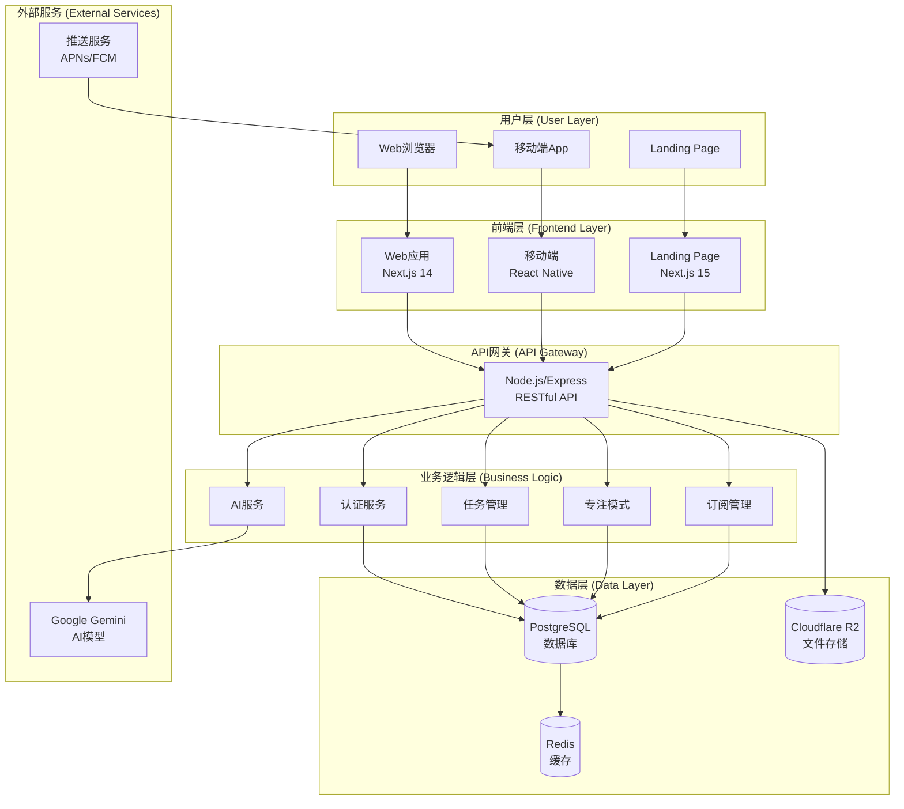

# Dopamind Web 技术架构文档

## 架构概览

Dopamind Web采用现代化的前端架构，基于Next.js 14构建，与现有的Dopamind生态系统完全集成。

### 整体架构图



## 前端架构详细设计

### 1. 技术栈选择

| 类别 | 技术 | 版本 | 选择理由 |
|------|------|------|----------|
| **核心框架** | Next.js | 14+ | App Router, SSR/SSG, 优秀的开发体验 |
| **UI库** | React | 18+ | 成熟生态，与移动端保持一致 |
| **类型系统** | TypeScript | 5+ | 类型安全，提高代码质量 |
| **样式方案** | Tailwind CSS | 3+ | 原子化CSS，快速开发 |
| **组件库** | shadcn/ui | Latest | 现代化组件，基于Radix UI |
| **状态管理** | Zustand | 4+ | 轻量级，易于使用 |
| **服务端状态** | React Query | 5+ | 强大的数据获取和缓存 |
| **表单处理** | React Hook Form | 7+ | 高性能表单处理 |
| **动画库** | Framer Motion | 10+ | 流畅的动画体验 |
| **图表库** | Chart.js/Recharts | Latest | 丰富的数据可视化 |

### 2. 项目结构设计

```
src/
├── app/                          # Next.js App Router
│   ├── (auth)/                  # 认证路由组
│   │   ├── login/              # 登录页面
│   │   └── register/           # 注册页面
│   ├── (dashboard)/            # 主应用路由组
│   │   ├── layout.tsx         # 仪表板布局
│   │   ├── page.tsx           # 仪表板首页
│   │   ├── tasks/             # 任务管理
│   │   ├── focus/             # 专注模式
│   │   ├── analytics/         # 数据分析
│   │   ├── subscriptions/     # 订阅管理
│   │   └── settings/          # 设置页面
│   ├── api/                    # API路由 (如需要)
│   ├── globals.css            # 全局样式
│   ├── layout.tsx             # 根布局
│   └── loading.tsx            # 全局加载组件
├── components/                 # React组件
│   ├── ui/                    # shadcn/ui基础组件
│   ├── layout/                # 布局相关组件
│   │   ├── Sidebar.tsx       # 侧边栏
│   │   ├── Header.tsx        # 顶部导航
│   │   └── Footer.tsx        # 底部
│   ├── tasks/                 # 任务相关组件
│   ├── chat/                  # AI对话组件
│   ├── focus/                 # 专注模式组件
│   └── common/                # 通用组件
├── lib/                       # 工具库
│   ├── api.ts                # API客户端
│   ├── auth.ts               # 认证逻辑
│   ├── utils.ts              # 通用工具函数
│   ├── constants.ts          # 常量定义
│   └── validations.ts        # 数据验证模式
├── stores/                    # 状态管理
│   ├── auth.ts               # 认证状态
│   ├── tasks.ts              # 任务状态
│   ├── chat.ts               # 聊天状态
│   └── ui.ts                 # UI状态
├── hooks/                     # 自定义Hooks
│   ├── useAuth.ts            # 认证Hook
│   ├── useTasks.ts           # 任务Hook
│   └── useChat.ts            # 聊天Hook
├── types/                     # TypeScript类型
│   ├── api.ts                # API类型定义
│   ├── auth.ts               # 认证类型
│   └── index.ts              # 导出所有类型
└── styles/                    # 样式文件
    └── components.css         # 组件样式
```

### 3. 状态管理架构

#### 3.1 Zustand Store设计

```typescript
// stores/auth.ts
interface AuthState {
  user: User | null
  token: string | null
  isLoading: boolean
  isAuthenticated: boolean
  login: (credentials: LoginCredentials) => Promise<void>
  logout: () => void
  refresh: () => Promise<void>
}

// stores/tasks.ts
interface TasksState {
  tasks: Task[]
  currentTask: Task | null
  isLoading: boolean
  filters: TaskFilters
  setTasks: (tasks: Task[]) => void
  addTask: (task: Task) => void
  updateTask: (id: string, updates: Partial<Task>) => void
  deleteTask: (id: string) => void
  setFilters: (filters: TaskFilters) => void
}

// stores/chat.ts
interface ChatState {
  messages: ChatMessage[]
  isLoading: boolean
  currentSessionId: string | null
  sendMessage: (content: string) => Promise<void>
  loadHistory: () => Promise<void>
  clearHistory: () => void
}
```

#### 3.2 React Query配置

```typescript
// lib/react-query.ts
export const queryClient = new QueryClient({
  defaultOptions: {
    queries: {
      staleTime: 5 * 60 * 1000, // 5分钟
      cacheTime: 10 * 60 * 1000, // 10分钟
      retry: 3,
      refetchOnWindowFocus: false,
    },
    mutations: {
      retry: 1,
    },
  },
})

// hooks/useTasks.ts
export const useTasks = () => {
  return useQuery({
    queryKey: ['tasks'],
    queryFn: () => apiClient.get('/tasks'),
    staleTime: 2 * 60 * 1000, // 2分钟
  })
}
```

### 4. API集成设计

#### 4.1 API客户端封装

```typescript
// lib/api.ts
class ApiClient {
  private baseURL: string
  private token: string | null = null

  constructor(baseURL: string) {
    this.baseURL = baseURL
    this.setupInterceptors()
  }

  private setupInterceptors() {
    // 请求拦截器 - 添加认证头
    // 响应拦截器 - 处理错误和token刷新
  }

  // RESTful API方法
  async get<T>(url: string): Promise<T>
  async post<T>(url: string, data: any): Promise<T>
  async put<T>(url: string, data: any): Promise<T>
  async delete<T>(url: string): Promise<T>
}

export const apiClient = new ApiClient(process.env.NEXT_PUBLIC_API_URL!)
```

#### 4.2 实时通信

```typescript
// lib/websocket.ts
class WebSocketManager {
  private ws: WebSocket | null = null
  private reconnectAttempts = 0
  private maxReconnectAttempts = 5

  connect(token: string) {
    this.ws = new WebSocket(`${WS_URL}?token=${token}`)
    this.setupEventListeners()
  }

  private setupEventListeners() {
    this.ws?.addEventListener('message', this.handleMessage)
    this.ws?.addEventListener('close', this.handleClose)
    this.ws?.addEventListener('error', this.handleError)
  }

  private handleMessage = (event: MessageEvent) => {
    const data = JSON.parse(event.data)
    // 根据消息类型分发到不同的store
  }
}
```

### 5. UI/UX设计系统

#### 5.1 设计原则

- **桌面优先**: 充分利用大屏幕空间
- **键盘友好**: 完善的快捷键支持
- **渐进增强**: 移动端适配
- **无障碍**: WCAG 2.1 AA标准

#### 5.2 布局系统

```typescript
// components/layout/DashboardLayout.tsx
export function DashboardLayout({ children }: { children: React.ReactNode }) {
  return (
    <div className="flex h-screen bg-gray-50">
      <Sidebar />
      <div className="flex-1 flex flex-col overflow-hidden">
        <Header />
        <main className="flex-1 overflow-auto p-6">
          {children}
        </main>
      </div>
    </div>
  )
}
```

#### 5.3 响应式设计

```css
/* styles/globals.css */
@layer utilities {
  .container-fluid {
    @apply w-full px-4 mx-auto;
  }
  
  .sidebar-width {
    @apply w-64 lg:w-72 xl:w-80;
  }
  
  .main-content {
    @apply flex-1 min-w-0 lg:pl-6;
  }
}

/* 响应式断点 */
@screen sm { /* 640px+ */ }
@screen md { /* 768px+ */ }
@screen lg { /* 1024px+ */ }
@screen xl { /* 1280px+ */ }
@screen 2xl { /* 1536px+ */ }
```

### 6. 性能优化策略

#### 6.1 代码分割

```typescript
// 路由级别代码分割
const TasksPage = dynamic(() => import('@/app/tasks/page'), {
  loading: () => <PageSkeleton />,
})

// 组件级别代码分割
const ChartComponent = dynamic(() => import('@/components/Chart'), {
  ssr: false,
  loading: () => <ChartSkeleton />,
})
```

#### 6.2 数据预取和缓存

```typescript
// 使用React Query的预取
export async function getServerSideProps() {
  const queryClient = new QueryClient()
  
  await queryClient.prefetchQuery({
    queryKey: ['tasks'],
    queryFn: fetchTasks,
  })
  
  return {
    props: {
      dehydratedState: dehydrate(queryClient),
    },
  }
}
```

#### 6.3 图片和资源优化

```typescript
// next.config.js
module.exports = {
  images: {
    domains: ['r2.dopamind.com'],
    formats: ['image/webp', 'image/avif'],
  },
  experimental: {
    optimizeCss: true,
  },
}
```

### 7. 安全考虑

#### 7.1 认证和授权

```typescript
// middleware.ts
export function middleware(request: NextRequest) {
  const token = request.cookies.get('token')?.value
  
  if (!token && request.nextUrl.pathname.startsWith('/dashboard')) {
    return NextResponse.redirect(new URL('/login', request.url))
  }
  
  // JWT验证逻辑
}

export const config = {
  matcher: ['/dashboard/:path*', '/api/:path*']
}
```

#### 7.2 数据验证

```typescript
// lib/validations.ts
import { z } from 'zod'

export const taskSchema = z.object({
  title: z.string().min(1, '任务标题不能为空'),
  description: z.string().optional(),
  dueDate: z.date().optional(),
  priority: z.enum(['low', 'medium', 'high']),
})

export type TaskFormData = z.infer<typeof taskSchema>
```

### 8. 测试策略

#### 8.1 单元测试

```typescript
// __tests__/components/TaskItem.test.tsx
import { render, screen, fireEvent } from '@testing-library/react'
import { TaskItem } from '@/components/tasks/TaskItem'

describe('TaskItem', () => {
  it('should render task title', () => {
    const task = { id: '1', title: 'Test Task', completed: false }
    render(<TaskItem task={task} onToggle={jest.fn()} />)
    
    expect(screen.getByText('Test Task')).toBeInTheDocument()
  })
})
```

#### 8.2 E2E测试

```typescript
// e2e/auth.spec.ts
import { test, expect } from '@playwright/test'

test('user can login', async ({ page }) => {
  await page.goto('/login')
  await page.fill('[name="email"]', 'test@example.com')
  await page.fill('[name="password"]', 'password')
  await page.click('button[type="submit"]')
  
  await expect(page).toHaveURL('/dashboard')
})
```

### 9. 部署和运维

#### 9.1 构建优化

```javascript
// next.config.js
module.exports = {
  output: 'standalone',
  compress: true,
  poweredByHeader: false,
  generateEtags: false,
  
  webpack: (config, { isServer }) => {
    if (!isServer) {
      config.resolve.fallback.fs = false
    }
    return config
  },
}
```

#### 9.2 环境配置

```bash
# .env.production
NEXT_PUBLIC_API_URL=https://api.dopamind.com
NEXT_PUBLIC_WS_URL=wss://api.dopamind.com
NEXT_PUBLIC_ENVIRONMENT=production

# 分析和监控
NEXT_PUBLIC_SENTRY_DSN=...
NEXT_PUBLIC_GOOGLE_ANALYTICS=...
```

### 10. 监控和分析

#### 10.1 性能监控

```typescript
// lib/analytics.ts
import { getCLS, getFID, getFCP, getLCP, getTTFB } from 'web-vitals'

export function reportWebVitals(metric: any) {
  // 发送性能指标到分析服务
  analytics.track('Web Vitals', {
    name: metric.name,
    value: metric.value,
    id: metric.id,
  })
}
```

#### 10.2 错误追踪

```typescript
// lib/error-tracking.ts
import * as Sentry from '@sentry/nextjs'

Sentry.init({
  dsn: process.env.NEXT_PUBLIC_SENTRY_DSN,
  environment: process.env.NEXT_PUBLIC_ENVIRONMENT,
  tracesSampleRate: 0.1,
})
```

这份技术架构文档为Dopamind Web的开发提供了全面的技术指导，确保项目能够按照最佳实践进行构建和维护。